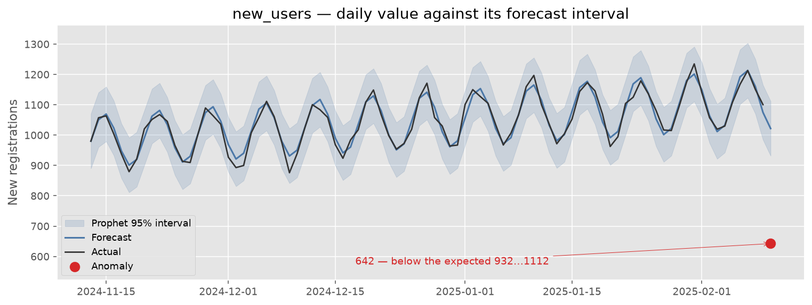
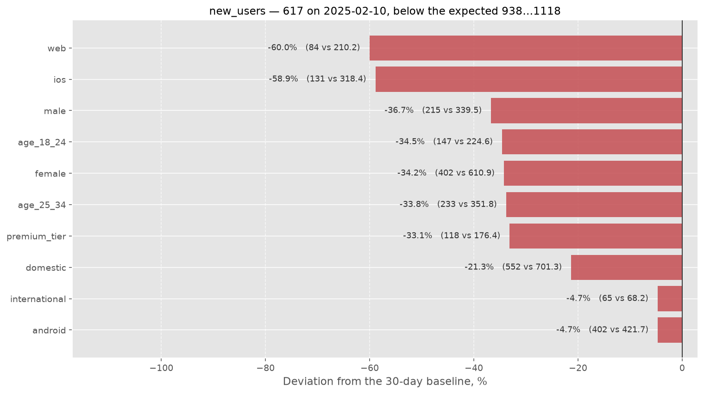
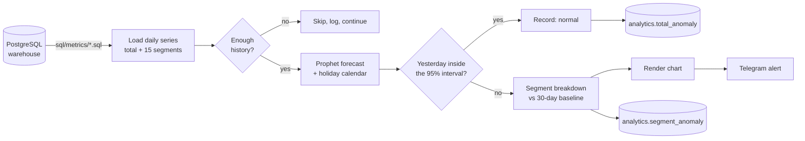

# Metric Anomaly Detection

**A production Airflow pipeline that watches core product metrics, catches the days they break, and tells you which user segment caused it — before anyone opens a dashboard.**

[](https://github.com/USERNAME/anomaly-detection-pipeline/actions/workflows/ci.yml)
[](https://www.python.org/)
[](https://facebook.github.io/prophet/)
[](https://airflow.apache.org/)
[](https://docs.astral.sh/ruff/)
[](LICENSE)



> 🇷🇺 [Читать по-русски](README.ru.md)

---

## The problem

A consumer product tracks a handful of numbers that actually matter: registrations, activations, conversion, returning users. They live on a dashboard, and a dashboard only works if someone looks at it — with fresh eyes, every morning, across every segment.

Nobody does. A broken iOS signup form, a payment provider outage, a mis-targeted ad campaign: each one shows up as a dip that is obvious a week later and invisible on the day it happens. And when someone finally spots it, the first hour goes into the question the chart cannot answer — *which* users stopped converting?

## What this does

Every night, for each monitored metric:

1. **Pulls two years of daily history** from the warehouse, already split into 15 user segments.
2. **Fits a Prophet forecast** on everything up to yesterday — weekly seasonality, trend changepoints and a public-holiday calendar, so a quiet January 2nd is not an incident.
3. **Compares yesterday against its prediction interval.** Inside the band: nothing happens. Outside: the metric is flagged.
4. **Explains the flag** by measuring every segment against *its own* 30-day baseline, so the alert names the platform, age bucket or market that moved.
5. **Sends the alert to Telegram** with the chart attached, and writes both the verdict and the segment breakdown back to the warehouse for the BI layer.

Metrics with weekly grain (cohort retention, average lifetime) are only evaluated on Mondays, when the week that just closed is complete.

## What an alert looks like

> ❗ New registrations on 2025-02-10: 617 is below the expected range (938 … 1118).



Registrations are down 38%. The breakdown says web is down 60% and iOS 59%, while Android barely moved — that is not a demand problem, that is a broken signup form on two platforms. The on-call analyst starts the day with a hypothesis instead of a question.

## How it works



**Detection.** Prophet with multiplicative seasonality and a high `changepoint_prior_scale`, so the model follows real trend shifts instead of alerting on every one of them. The interval width (default 95%) is the sensitivity dial; a metric that needs a hard business threshold instead can pin a constant band in config.

**Root-cause hints.** Segment attribution is intentionally not a second model. Each segment is compared to its own trailing 30-day mean, which is robust, explainable in one sentence, and does not need 15 more fits per metric. The chart labels every bar with its absolute value next to its baseline, because a −60% move on a segment of 84 users means something very different from −60% on a segment of 8 400.

**Guard rails.** A series shorter than 30 usable points is refused rather than fitted. Rows with gaps are dropped before the fit. A metric that fails takes only itself down — the rest of the run continues, and whatever succeeded is still written and reported. Re-running the same day replaces that day's rows instead of duplicating them, so a retry is safe.

## Repository layout

```
├── src/anomaly_detection/
│   ├── config.py          # YAML + environment; no secrets in the source
│   ├── db.py              # warehouse access, idempotent writes
│   ├── detection.py       # forecast comparison + segment attribution
│   ├── holidays.py        # holiday calendar handed to Prophet
│   ├── notifications.py   # chart rendering + Telegram delivery
│   ├── pipeline.py        # orchestration, per-metric isolation
│   └── __main__.py        # CLI
├── sql/
│   ├── metrics/           # one query per metric
│   └── schema/            # reference source schema + result tables
├── dags/                  # Airflow DAG and failure callback
├── config/metrics.yaml    # what is monitored, and how sensitively
└── tests/                 # 27 tests, no warehouse required
```

## Quick start

```bash
git clone https://github.com/USERNAME/anomaly-detection-pipeline.git
cd anomaly-detection-pipeline

python -m venv .venv && source .venv/bin/activate
pip install -r requirements.txt

cp .env.example .env      # fill in the DSN and the Telegram credentials
```

Run everything that is due today:

```bash
python -m anomaly_detection
```

Run one metric, write nothing, send nothing — the way to try a sensitivity change:

```bash
python -m anomaly_detection --metrics new_users --dry-run --verbose
```

| Flag | Purpose |
| --- | --- |
| `--metrics NAME [NAME...]` | run a subset, ignoring the weekly/daily schedule |
| `--date YYYY-MM-DD` | treat another date as today |
| `--dry-run` | check and chart, but never write or alert |
| `--chart-dir PATH` | keep the rendered charts |
| `--config PATH` | use a different `metrics.yaml` |

## Configuration

Everything monitored is declared in [`config/metrics.yaml`](config/metrics.yaml):

```yaml
detection:
  interval_width: 0.95        # sensitivity
  min_history_points: 30      # refuse to fit on shorter history
  segment_baseline_days: 30

metrics:
  - name: new_users
    query: new_users.sql
    grain: daily
    title: New registrations

  - name: s2_retention_14d
    query: s2_retention_14d.sql
    grain: weekly             # evaluated on Mondays only
```

Adding a metric is a query plus five lines of YAML. No Python changes.

## Pointing it at your own warehouse

Each query must return exactly this shape:

| Column | Meaning |
| --- | --- |
| `date_trunc` | the day (or week) bucket |
| `<segment>_<metric>` | one column per segment, e.g. `ios_new_users` |
| `total_<metric>` | the aggregate the forecast is fitted on |

Everything else — which segments exist, how they are named — is derived from the column names, so a new dimension only needs to be added to the SQL. [`sql/schema/00_source_schema_reference.sql`](sql/schema/00_source_schema_reference.sql) documents the schema the shipped queries assume.

## Deployment

The pipeline runs as a single daily Airflow task at 03:15 UTC, after the nightly warehouse refresh lands:

```python
with DAG(dag_id="anomaly_detection", schedule_interval="15 3 * * *", ...) as dag:
    PythonOperator(task_id="detect_anomalies", python_callable=run_anomaly_detection)
```

Credentials are read from Airflow Variables when running on Airflow and from the environment when running standalone — [`config.py`](src/anomaly_detection/config.py) resolves both, and neither path has a value baked into the source. Failures notify the same Telegram chat: an alerting pipeline that dies quietly is worse than no pipeline at all.

## Development

```bash
pip install -r requirements-dev.txt
make test      # 27 tests, ~1s, no database and no model fit required
make lint      # ruff check + format check
```

The Prophet fit is stubbed in tests. What the suite protects is the logic around it — data hygiene, bound comparison, rounding, scheduling, segment attribution and alert formatting — which is where a bug would either page an analyst at 3am for nothing, or stay silent when it matters.

## A note on the SQL

This repository is a cleaned-up version of a pipeline that runs in production at a consumer product company. The original queries ran against a proprietary warehouse schema, so **every query here has been rewritten against a neutral demo schema**: the analytical logic (cohort retention, dormancy-based return attribution, windowed conversion) is intact, while internal table names, business definitions and data models are not disclosed. No credentials, connection strings or customer data are present anywhere in this repository or its history.

## License

MIT — see [LICENSE](LICENSE).
