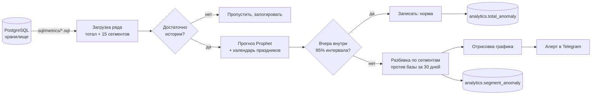

# Детекция аномалий в продуктовых метриках

**Продакшен-пайплайн на Airflow, который каждую ночь проверяет ключевые продуктовые метрики, ловит дни, когда они ломаются, и сразу говорит, какой сегмент пользователей за это отвечает — до того, как кто-то откроет дашборд.**

[](https://github.com/USERNAME/anomaly-detection-pipeline/actions/workflows/ci.yml)
[](https://www.python.org/)
[](https://facebook.github.io/prophet/)
[](https://airflow.apache.org/)
[](https://docs.astral.sh/ruff/)
[](LICENSE)


> 🇬🇧 [Read in English](README.md)

---

## Задача

У продукта есть несколько чисел, которые действительно важны: регистрации, активации, конверсия, возвращаемость. Они лежат на дашборде — а дашборд работает только если кто-то в него смотрит: свежим взглядом, каждое утро, во всех разрезах.

Так не бывает. Сломанная форма регистрации на iOS, сбой платёжного провайдера, криво настроенная кампания — каждая история выглядит как провал, очевидный через неделю и незаметный в тот день, когда он случился. А когда провал наконец замечают, первый час уходит на вопрос, на который график ответить не может: *кто именно* перестал конвертиться?

## Что делает пайплайн

Каждую ночь по каждой отслеживаемой метрике:

1. **Забирает два года дневной истории** из хранилища — сразу в разрезе 15 сегментов пользователей.
2. **Обучает Prophet** на всей истории до вчерашнего дня: недельная сезонность, точки смены тренда и календарь праздников, чтобы тихое 2 января не считалось инцидентом.
3. **Сравнивает вчерашний факт с прогнозным интервалом.** Внутри коридора — ничего не происходит. Снаружи — метрика помечается как аномалия.
4. **Объясняет аномалию**: каждый сегмент сравнивается с его *собственной* базой за 30 дней, поэтому алерт сразу называет платформу, возрастную группу или рынок, который сдвинулся.
5. **Отправляет алерт в Telegram** с графиком и записывает и вердикт, и разбивку по сегментам обратно в хранилище — для BI-слоя.

Недельные метрики (когортная ретенция, средний lifetime) считаются только по понедельникам, когда закрытая неделя стала полной.

## Как выглядит алерт

> ❗ New registrations on 2025-02-10: 617 is below the expected range (938 … 1118).


Регистрации упали на 38%. Разбивка показывает: web −60%, iOS −59%, а Android почти не двинулся. Это не падение спроса — это сломанная форма регистрации на двух платформах. Дежурный аналитик начинает утро с гипотезы, а не с вопроса.

## Как это устроено



**Детекция.** Prophet с мультипликативной сезонностью и высоким `changepoint_prior_scale`: модель следует за реальными сменами тренда, а не поднимает алерт на каждой из них. Ширина интервала (по умолчанию 95%) — ручка чувствительности; метрике, которой нужен жёсткий бизнесовый порог, можно задать константный коридор прямо в конфиге.

**Подсказки о причине.** Атрибуция по сегментам сознательно сделана без второй модели. Каждый сегмент сравнивается со своим скользящим средним за 30 дней: это устойчиво, объясняется одной фразой и не требует ещё 15 обучений на метрику. На графике у каждого столбца подписано абсолютное значение рядом с базой — потому что −60% на сегменте в 84 пользователя и −60% на сегменте в 8 400 означают совершенно разное.

**Предохранители.** Ряд короче 30 пригодных точек не обучается, а отклоняется. Строки с пропусками удаляются до обучения. Упавшая метрика роняет только себя: остальной запуск продолжается, а всё, что посчиталось, всё равно записывается и отправляется. Повторный запуск за тот же день перезаписывает строки этого дня, а не дублирует их, — ретрай безопасен.

## Структура репозитория

```
├── src/anomaly_detection/
│   ├── config.py          # YAML + переменные окружения; секретов в коде нет
│   ├── db.py              # доступ к хранилищу, идемпотентная запись
│   ├── detection.py       # сравнение с прогнозом + атрибуция по сегментам
│   ├── holidays.py        # календарь праздников для Prophet
│   ├── notifications.py   # отрисовка графика + доставка в Telegram
│   ├── pipeline.py        # оркестрация, изоляция метрик друг от друга
│   └── __main__.py        # CLI
├── sql/
│   ├── metrics/           # по одному запросу на метрику
│   └── schema/            # референсная схема источника + таблицы результатов
├── dags/                  # Airflow DAG и колбэк на падение
├── config/metrics.yaml    # что мониторим и с какой чувствительностью
└── tests/                 # 27 тестов, хранилище не требуется
```

## Быстрый старт

```bash
git clone https://github.com/USERNAME/anomaly-detection-pipeline.git
cd anomaly-detection-pipeline

python -m venv .venv && source .venv/bin/activate
pip install -r requirements.txt

cp .env.example .env      # заполнить DSN и доступы к Telegram
```

Запустить всё, что положено на сегодня:

```bash
python -m anomaly_detection
```

Запустить одну метрику, ничего не записывая и не отправляя, — так удобно проверять изменение чувствительности:

```bash
python -m anomaly_detection --metrics new_users --dry-run --verbose
```

| Флаг | Назначение |
| --- | --- |
| `--metrics NAME [NAME...]` | прогнать подмножество метрик, игнорируя расписание |
| `--date YYYY-MM-DD` | считать «сегодня» другой датой |
| `--dry-run` | посчитать и нарисовать, но не писать и не алертить |
| `--chart-dir PATH` | сохранить отрисованные графики |
| `--config PATH` | использовать другой `metrics.yaml` |

## Конфигурация

Всё, что мониторится, описано в [`config/metrics.yaml`](config/metrics.yaml):

```yaml
detection:
  interval_width: 0.95        # чувствительность
  min_history_points: 30      # не обучаться на более короткой истории
  segment_baseline_days: 30

metrics:
  - name: new_users
    query: new_users.sql
    grain: daily
    title: New registrations

  - name: s2_retention_14d
    query: s2_retention_14d.sql
    grain: weekly             # считается только по понедельникам
```

Добавить метрику — это запрос плюс пять строк YAML. Питон трогать не нужно.

## Как подключить своё хранилище

Каждый запрос должен возвращать ровно такую форму:

| Колонка | Смысл |
| --- | --- |
| `date_trunc` | дневной (или недельный) бакет |
| `<segment>_<metric>` | по колонке на сегмент, например `ios_new_users` |
| `total_<metric>` | агрегат, на котором обучается прогноз |

Всё остальное — какие сегменты существуют и как они называются — выводится из имён колонок, поэтому новое измерение достаточно добавить в SQL. Схема, которую предполагают запросы, описана в [`sql/schema/00_source_schema_reference.sql`](sql/schema/00_source_schema_reference.sql).

## Деплой

Пайплайн работает как одна ежедневная задача Airflow в 03:15 UTC — после того как отработал ночной пересчёт хранилища:

```python
with DAG(dag_id="anomaly_detection", schedule_interval="15 3 * * *", ...) as dag:
    PythonOperator(task_id="detect_anomalies", python_callable=run_anomaly_detection)
```

Доступы читаются из Airflow Variables при запуске в Airflow и из окружения при локальном запуске — [`config.py`](src/anomaly_detection/config.py) поддерживает оба пути, и ни в одном из них значение не зашито в код. О падениях сообщается в тот же Telegram-чат: пайплайн-алертинг, который умирает молча, хуже, чем его отсутствие.

## Разработка

```bash
pip install -r requirements-dev.txt
make test      # 27 тестов, ~1 секунда, без базы и без обучения модели
make lint      # ruff check + проверка форматирования
```

Обучение Prophet в тестах подменяется заглушкой. Суть тестов — логика вокруг модели: чистка данных, сравнение с границами, округление, расписание, атрибуция по сегментам и формат алерта. Именно там баг либо разбудит аналитика в три часа ночи без повода, либо промолчит, когда молчать нельзя.

## Про SQL

Это причёсанная версия пайплайна, работающего в проде продуктовой компании. Оригинальные запросы обращались к проприетарной схеме хранилища, поэтому **все запросы здесь переписаны на нейтральную демо-схему**: аналитическая логика (когортная ретенция, атрибуция возвратов через окно неактивности, конверсия в окне) сохранена, а внутренние названия таблиц, бизнес-определения и модель данных не раскрываются. Ни доступов, ни строк подключения, ни пользовательских данных ни в репозитории, ни в его истории нет.

## Лицензия

MIT — см. [LICENSE](LICENSE).
